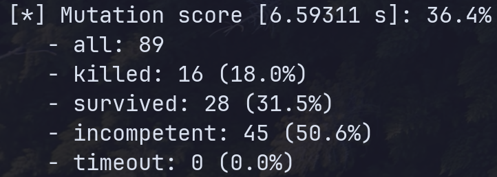

# Mutation Testing

**Run Mutpy**
`mut.py --target mutation/Polynomial.py --unit-test tests/test_PolyTest.py --runner pytest`

**Mutations**

Arithmetic Operator Substitution: Substitutes arithmetic operators with alternative ones.
Arithmetic Operator Modification: Modifies the arithmetic operators to introduce variations.
Assignment Operator Substitution: Substitutes assignment operators with alternative ones.
Boolean Condition Substitution: Substitutes boolean conditions with alternatives.
Conditional Operator Incorporation: Incorporates conditional operators into boolean expressions.
Relational Operator Substitution: Substitutes relational operators with alternatives.
Statement Incorporation and Deletion: Incorporates or deletes statements in the code.

**Impacts**

1. AOD Mutations: The application of one mutant led to its termination by test_mutated_str, indicating a significant impact on the __str__ method. This mutation is of concern and requires attention.

2. AOR Mutations: Multiple mutants were applied, with some succumbing to specific tests (test_str, test_add, test_mutated_add). However, others persisted or were deemed ineffective. These mutations pose a serious threat, influencing arithmetic operations and potentially causing incorrect outcomes.

3. ASR Mutations: No mutants were employed in this case.

4. BCR Mutations: The application of one mutant resulted in termination by test_str, highlighting its influence on boolean conditions. This mutation demands serious consideration.

5. COI Mutations: Several mutants were introduced, with some being terminated by specific tests (test_str, test_first_degree_polynomial). Others endured or were deemed inadequate. These mutations have the potential to impact conditional logic and should be treated as serious.

6. ROR Mutations: Multiple mutants were applied, with some being terminated by specific tests (test_str, test_first_degree_polynomial). Others persisted or were considered ineffective. These mutations are serious, affecting relational operations and warrant careful scrutiny.

7. SIR Mutations: The application of one mutant resulted in survival. This mutation is serious as it involves the insertion or removal of statements in the code, demanding thorough investigation.

**Summary**
 

**Analysis**

The test suite has proven its efficacy in identifying and eliminating mutants, showcasing strength in certain areas. Notably, it successfully pinpointed mutations in Arithmetic Operations (AOR) and Conditional Operator Insertion (COI), contributing to the overall robustness of the suite.

However, there are areas where the test suite reveals room for improvement:

1. Arithmetic Operator Replacement (AOD): The survival of mutants suggests a need for additional test cases or an enhancement of existing scenarios to achieve comprehensive coverage of AOD mutations. Strengthening this aspect would further fortify the suite against potential vulnerabilities in arithmetic operations.

2. Boolean Condition Replacement (BCR): The lack of effective detection for BCR mutations underscores a gap in the test suite's coverage. Addressing this limitation is crucial to ensure the suite's ability to identify and eliminate mutants related to boolean conditions, thereby enhancing its overall effectiveness.

3. Statement Insertion/Removal (SIR): The undetected SIR mutation signals a potential blind spot in the test suite. A thorough examination and adjustment of the test cases may be necessary to improve the suite's capability to identify mutations involving the insertion or removal of statements.

Acknowledging these areas for enhancement, the ongoing refinement of the test suite should focus on expanding coverage and improving test scenarios to bolster its effectiveness in identifying and addressing mutations across diverse code scenarios.

**Improvements**

1. Enhance Test Coverage:

   - Arithmetic Operator Replacement (AOD): Introduce test cases that deliberately manipulate arithmetic operators, ensuring the comprehensive coverage of AOD mutations.
   - Boolean Condition Replacement (BCR): Create test scenarios specifically designed to assess variations in boolean conditions, addressing the existing gap in the test suite.
   - Statement Insertion/Removal (SIR): Develop test cases to assess the impact of inserted or removed statements on the code's behavior, addressing the current blind spot in the suite.

2. Refine Test Cases:

    - Review existing test cases for Arithmetic Operations (AOR) and Conditional Operator Insertion (COI), ensuring they are robust and cover a wide range of scenarios.
    - Evaluate the effectiveness of current AOD and BCR test cases, refining them to better expose potential weaknesses and enhance the overall quality of the test suite.

3. Consider Edge Cases:

    - Identify edge cases, boundary conditions, and corner cases for each mutation type (AOD, BCR, SIR, etc.).
    - Develop test cases that specifically target these edge scenarios to ensure the test suite is thorough in evaluating the code's behavior under diverse conditions.

4. Address Timeout Issues:

    - Investigate and analyze any timeout issues encountered during the mutation testing process.
    - Optimize the testing environment or adjust parameters to prevent premature timeouts, ensuring that all mutants undergo proper evaluation and contribute to the overall effectiveness of the testing process.

By implementing these steps, the test suite can evolve to be more comprehensive, robust, and capable of detecting mutations across a broader spectrum of scenarios and conditions. This iterative improvement process is essential for maintaining the reliability of the test suite and enhancing its ability to identify and eliminate potential vulnerabilities in the codebase.

**Conclusion**

The test suite exhibits commendable proficiency in identifying mutations related to arithmetic operations, conditional operator insertions, and relational operator replacements within the Polynomial class. This highlights its effectiveness in certain critical areas. However, the identified gaps in detecting arithmetic operator replacements, boolean condition replacements, and statement insertions/removals underscore the need for improvement.